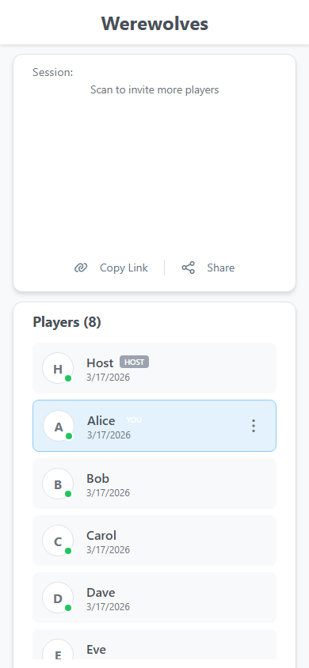
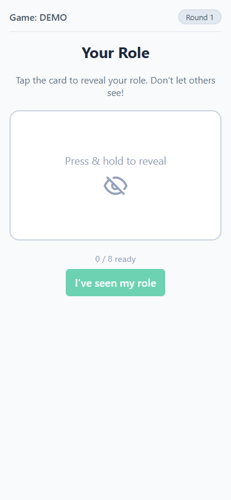
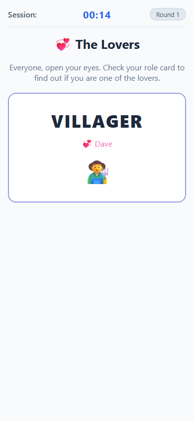
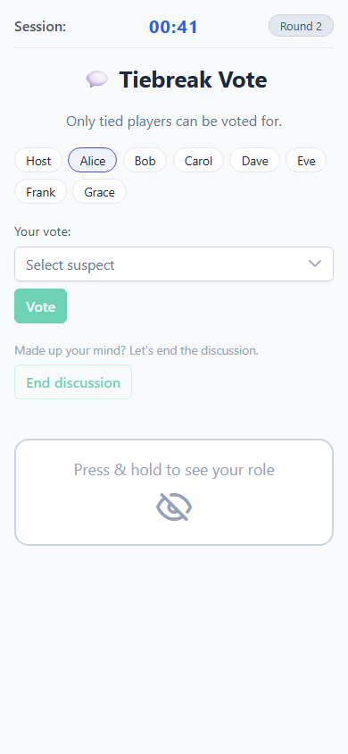
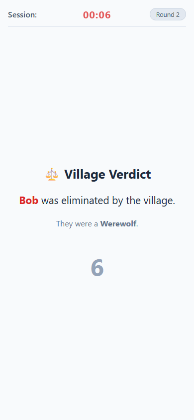
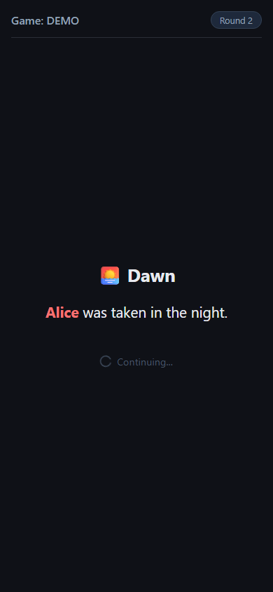
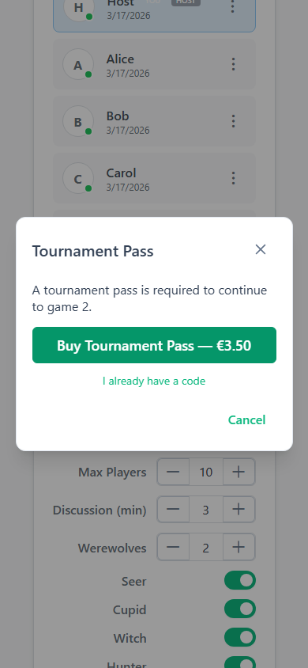

# Game Concept & Rules

## Overview

Werewolves is a hidden-role social deduction game for groups. The app replaces the human moderator, handling role assignment, phase narration via text-to-speech, countdown timers, and vote tallying while the players sit together in the same room. Players join the session on their own phones; each phone shows only what that player is allowed to see.

---

## Roles

| Role | Team | Goal |
|---|---|---|
| **Werewolf** | Wolves | Eliminate all villagers before being outnumbered |
| **Villager** | Village | Identify and eliminate all werewolves through discussion and voting |
| **Seer** | Village | Each night, secretly learn one player's true alignment (wolf or villager) |
| **Witch** | Village | One-use heal potion to save tonight's victim; one-use poison to eliminate any player |
| **Hunter** | Village | When eliminated (night or day), immediately shoots one other surviving player |
| **Cupid** | Village | On the very first night, secretly links two players as lovers |

### Special Rule: Lovers

When Cupid links two players, each receives a private notification of their partner's name on their role card.

- If one lover is eliminated for any reason, the other dies of heartbreak **immediately**
- Lovers share a secondary win condition: if both survive to the end they win **regardless** of team
- A Werewolf-Villager lover pair effectively becomes a third faction — they must outlast both sides

---

## Screens & Game Flow

### 1. Setup — Create & Join

The host creates a game and receives a QR code and shareable link. Other players scan the QR code or open the link on their own phones and enter their name.

  <figure style="flex:1;margin:0"><figcaption><strong>Create Game</strong></figcaption></figure>
  <figure style="flex:1;margin:0"><figcaption><strong>Join Game</strong></figcaption></figure>

---

### 2. Lobby

All players wait in the lobby while the host configures the game. Non-host players see the settings in read-only mode; only the host can change them and start the game.

**Configurable settings:**

| Setting | Description |
|---|---|
| Min / Max players | Lobby won't start below the minimum; capped at the maximum |
| Number of werewolves | How many Werewolf roles are assigned |
| Discussion duration | Minutes allotted for each day discussion phase |
| Skills (toggles) | Enable or disable Seer, Cupid, Witch, Hunter individually |

The Start Game button is only visible to the host and is disabled until sufficient players have joined and all skill/werewolf counts are consistent with the player count.

---

### 3. Role Reveal

Once the game starts, each player privately views their assigned role by pressing and holding their roll card. The card flips back the moment they release, so no-one nearby can glance at it.

Werewolves see the names of all fellow werewolves on their card. When everyone confirms they have seen their role, the first night begins.

---

### 4. Night — Werewolves Meeting *(Round 1 only)*

On the very first night, before anything else happens, the werewolves open their eyes and identify each other silently. Villagers see a generic waiting screen.

  <figure style="flex:1;margin:0"><figcaption><strong>Villager view</strong></figcaption></figure>
  <figure style="flex:1;margin:0"><figcaption><strong>Werewolf view</strong></figcaption></figure>

The werewolf screen shows the names of all pack members and a "I'm ready" button. Once all wolves have confirmed, the phase advances.

---

### 5. Night — Cupid Turn *(Round 1 only, if enabled)*

Cupid wakes up and secretly links two players as lovers. Everyone else sees a waiting screen.

  <figure style="flex:1;margin:0"><figcaption><strong>Non-Cupid view</strong></figcaption></figure>
  <figure style="flex:1;margin:0"><figcaption><strong>Cupid view</strong></figcaption></figure>

Cupid selects two players from the alive-players list and confirms. The lovers are notified privately during the Lover Reveal phase that immediately follows.

---

### 6. Lover Reveal *(Round 1 only, if Cupid is enabled)*

Everyone opens their eyes and checks their role card to see if they are one of the lovers.

If a player is a lover, their partner's name appears on the card when held down. All other players see their usual role with no lover name.

---

### 7. Day — Discussion & Voting *(Round 1: follows directly after the first night)*

After the first night — once the Lover Reveal has concluded (or the Werewolves Meeting if Cupid is not enabled) — the first day discussion begins immediately. No one has been killed yet, so there is no dawn announcement. Players discuss freely, sharing suspicions and defending themselves. Every player — including those already eliminated — casts one vote for who they believe is a werewolf. A countdown timer governs the discussion period.

Each player's current vote is shown live on their chip as an arrow (e.g. **Alice → Bob**), making alliances and suspicions immediately visible and fuelling the discussion.

When a player has made up their mind and wants to wrap up early, they can press **End discussion**. How many players have pressed this is shown next to the button (e.g. `3 / 8`), but only once at least one player has done so — the counter stays hidden otherwise so it does not invite premature use.

  <figure style="flex:1;margin:0"><figcaption><strong>Alive player</strong></figcaption></figure>
  <figure style="flex:1;margin:0"><figcaption><strong>Eliminated player</strong></figcaption></figure>

Eliminated players see a notice explaining they have been eliminated but can still vote to earn bonus points. When the timer ends or all living players confirm, votes are tallied.

---

### 8. Day — Tiebreak Discussion *(if a tie occurs)*

If two or more players are tied for most votes, a second short discussion round takes place. Only the tied candidates can be voted for this time.

If the tiebreak vote is also tied, no elimination occurs and the game moves straight to night.

---

### 9. Day Elimination

The player with the most votes is eliminated and their role is publicly revealed to everyone.

Win conditions are checked immediately after each elimination. If the Hunter was just eliminated, the Hunter Turn phase activates before the game continues.

---

### 10. Night — Werewolves Turn *(Round 2 onwards)*

The app narrates "close your eyes". Villagers see a waiting screen. Werewolves silently agree on a victim and confirm their vote.

  <figure style="flex:1;margin:0"><figcaption><strong>Villager view</strong></figcaption></figure>
  <figure style="flex:1;margin:0"><figcaption><strong>Werewolf view</strong></figcaption></figure>

The werewolf screen shows a dropdown of all living non-wolf players. Once every wolf has voted the same target (or the timer expires), the kill is locked in.

---

### 11. Night — Seer Turn *(if alive and enabled)*

The Seer wakes up and inspects one player. The result reveals whether that player is a Werewolf or a Villager, and shows their skill if they have one.

  <figure style="flex:1;margin:0"><figcaption><strong>Non-Seer view</strong></figcaption></figure>
  <figure style="flex:1;margin:0"><figcaption><strong>Seer view</strong></figcaption></figure>

The Seer receives the result immediately on their screen. This information is theirs alone — they must use it strategically during the day discussion without directly revealing how they know.

---

### 12. Night — Witch Turn *(if alive and enabled)*

The Witch wakes up last. She is shown tonight's werewolf victim and can use either, both, or none of her potions.

  <figure style="flex:1;margin:0"><figcaption><strong>Non-Witch view</strong></figcaption></figure>
  <figure style="flex:1;margin:0"><figcaption><strong>Witch view</strong></figcaption></figure>

**Potions (each usable only once per game):**

| Potion | Effect |
|---|---|
| 🧴 Heal | Saves tonight's werewolf victim; they survive the night |
| ☠️ Poison | Eliminates any living player of the Witch's choice |

Once a potion is used it is gone for the rest of the game. The "Do nothing" option advances the phase without using either.

---

### 13. Night — Hunter Turn *(triggered on elimination)*

The Hunter phase activates whenever the Hunter is eliminated — either by werewolves at night or by the village vote during the day. The Hunter gets one last action: shooting a player of their choice.

  <figure style="flex:1;margin:0"><figcaption><strong>Non-Hunter view</strong></figcaption></figure>
  <figure style="flex:1;margin:0"><figcaption><strong>Hunter view</strong></figcaption></figure>

The selected player is immediately eliminated. Win conditions are then re-checked.

---

### 14. Dawn — Night Elimination *(Round 2 onwards)*

The app reveals what happened overnight. Everyone "opens their eyes" and sees the night's outcome.

Possible outcomes:

- One or more players were killed by werewolves (and possibly saved or poisoned by the witch)
- The village woke up safely — nobody was taken
- The Witch saved the victim, but also poisoned someone else

After the announcement, the day discussion phase begins automatically.

---

### 15. Final Scores Reveal

The game ends when a win condition is met. All roles are revealed in a summary table, sorted by score. From the second game onwards a running **total** column appears alongside each player's per-game score, so everyone can see the tournament standings at a glance.

  <figure style="flex:1;margin:0"><figcaption><strong>After game 1</strong></figcaption></figure>
  <figure style="flex:1;margin:0"><figcaption><strong>After game 2+ (with totals)</strong></figcaption></figure>

| Winner | Condition |
|---|---|
| **Village** | All werewolves have been eliminated |
| **Werewolves** | Werewolves equal or outnumber the surviving villagers |
| **Lovers** | Both lovers survive to the end (only applies when they are from opposing teams) |

Players return to the lobby and can start a new game.

---

### 16. Tournament — Unlock Pass

Starting a second (or later) game requires a tournament pass. When the host presses **Start Game** from game 2 onwards, a modal appears asking for the pass code.

Entering the correct code unlocks the tournament (`isPremium = true`) and starts the game immediately. An incorrect code shows an error and lets the host try again. In development the bypass code is configured in `appsettings.Development.json` (`Tournament:BypassCode`); in production the field is empty until a real payment flow sets the flag via the backend.

---

## Win Condition Details

Win conditions are evaluated after **every** elimination — night kill, witch poison, and day vote all trigger a check. The precedence is:

1. **Lovers win** checked first (if applicable) — if both lovers are among the survivors and one of the standard win conditions is also met, the lovers take priority
2. **Werewolves win** — wolves ≥ living villagers
3. **Village wins** — all wolves eliminated

---

## Configurable Settings Reference

| Setting | Range | Description |
|---|---|---|
| Min players | 2–20 | Prevents the host from starting below this threshold |
| Max players | 4–20 | Cap on lobby size |
| Number of werewolves | 1–10 | Must be less than total player count minus special roles |
| Discussion duration | 1–30 min | Countdown for each Discussion and Tiebreak phase |
| Seer | on/off | Enables the Seer night action |
| Cupid | on/off | Enables Cupid + Lover Reveal on round 1 |
| Witch | on/off | Enables the Witch night action |
| Hunter | on/off | Enables the Hunter's last-shot ability |

---

## Future Feature Ideas

- **Token system** — spend tokens for special abilities (delay vote, peek hint, protect a player)
- **Multiple rounds per session** — session leaderboard across several games
- **Additional roles** — Doctor, Mayor, Bodyguard, etc.
