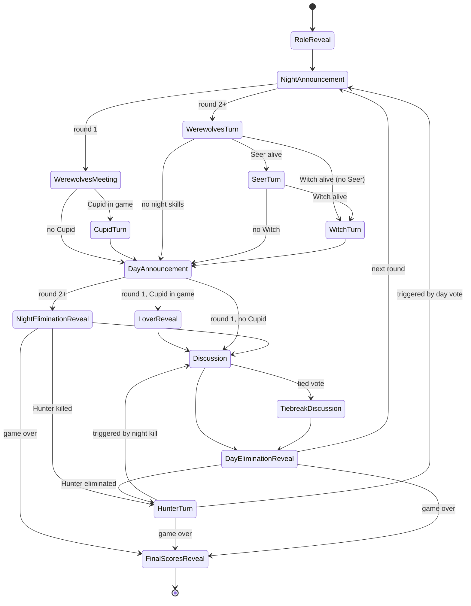

# Phases

## Session Shell

All in-game phases share a common shell rendered by `SessionComponent`:

- **Header bar** — game ID (left) and round number (right)
- **Eliminated banner** — shown when the local player has been eliminated
- **Timer bar** — displayed below the header whenever `phaseEndsAt` is set on `GameState`

Pre-game phases (Create Game, Join Game, Lobby) are independent components with no timer infrastructure.

---

## Phase Inventory

Phase durations and eligible-for-done player sets are the authoritative source of truth in `PhaseDescriptor.cs`.

| Phase | Time | Who acts | Description | Timer | Overtime |
|---|---|---|---|---|---|
| **Create Game** | Pre-game | Host | Enter name and settings, create game | — | — |
| **Join Game** | Pre-game | Joining player | Enter name, join via link or QR | — | — |
| **Lobby** | Pre-game | All / host | Wait for players; host starts game | — | — |
| **`RoleReveal`** | ☀️ Day | All players | Press-and-hold card to peek at role; confirm ready | None | — |
| **`NightAnnouncement`** | 🌑 Night | Passive | Night begins; everyone closes their eyes; auto-advances | 8 s | No |
| **`WerewolvesMeeting`** | 🌑 Night | Werewolves | Wolves identify each other; others wait with eyes closed | None | — |
| **`CupidTurn`** | 🌑 Night | Cupid | Cupid links two players as lovers | None | — |
| **`LoverReveal`** | ☀️ Day | Passive | Everyone checks role card for lover name; auto-advances | 20 s | No |
| **`WerewolvesTurn`** | 🌑 Night | Werewolves | Wolves pick a victim; others wait | None | — |
| **`SeerTurn`** | 🌑 Night | Seer | Seer inspects one player's alignment | None | — |
| **`WitchTurn`** | 🌑 Night | Witch | Save the victim, poison a target, or pass | None | — |
| **`DayAnnouncement`** | ☀️ Day | Passive | Dawn; everyone opens their eyes; auto-advances | 8 s | No |
| **`NightEliminationReveal`** | ☀️ Day | Passive | Dawn reveal: who died in the night; auto-advances | 10 s | No |
| **`HunterTurn`** | ☀️ Day | Hunter | Eliminated Hunter shoots one player | None | — |
| **`Discussion`** | ☀️ Day | All living | Players debate and cast votes | 5 min (configurable) | No |
| **`TiebreakDiscussion`** | ☀️ Day | All living | Same as Discussion; votes restricted to tied candidates | 60 s (configurable) | No |
| **`DayEliminationReveal`** | ☀️ Day | Passive | Verdict reveal: who the village eliminated; auto-advances | 10 s | No |
| **`FinalScoresReveal`** | ☀️ Day | All players | Winner announced; full role summary; auto-resets to lobby | 60 s | No |

---

## Timer Design

### Timer States

```
Normal:   ⏱ 1:23      white / muted
Urgent:   ⏱ 0:09      amber  — triggers at ≤ 10 s  (.urgent CSS class)
```

When a timed phase expires the server advances to the next phase automatically on the next client poll. There is no overtime — the deadline is hard.

### Implementation Notes

- Phase durations and eligible-for-done player sets are defined centrally in `PhaseDescriptor.cs`
- `phaseEndsAt: string | null` on `GameState` drives the timer bar; set by `BeginPhase` using the duration from `PhaseDescriptor`
- `secondsRemaining` is computed in `session.ts` from `phaseEndsAt` and is clamped at 0
- The `.urgent` threshold (≤ 10 s) remains unchanged

---

## Timer Bar Placement

**Current approach**: The timer bar sits below the header as a separate element, displayed only when `phaseEndsAt` is set.

**Alternative considered**: Move into the header's unused center slot — cleaner hierarchy but a busier header.

**Recommendation**: Extend the existing timer bar (current approach). Revisit placement if the UI feels crowded.

---

## Phase State Machine

The diagram below shows every valid phase transition. Edge labels describe the condition under which that path is taken; unlabelled edges are unconditional.



---

## Narration

| Narration key | Phase | Position | Condition |
|---|---|---|---|
| `role-reveal` | `RoleReveal` | Start | — |
| `werewolves-meeting-close-eyes` | `WerewolvesMeeting` | Start | — |
| `night-announcement` | `NightAnnouncement` | Start | — |
| `cupid-turn` | `CupidTurn` | Start | — |
| `day-announcement` | `DayAnnouncement` | Start | — |
| `lover-reveal` | `LoverReveal` | Start | — |
| `werewolves-turn` | `WerewolvesTurn` | Start | — |
| `night-warning` | `WerewolvesMeeting` / `WerewolvesTurn` | During (≤ 3 s remaining) | — |
| `seer-turn` | `SeerTurn` | Start | — |
| `witch-turn` | `WitchTurn` | Start | — |
| `night-end-no-deaths` | `NightEliminationReveal` | Start | 0 night eliminations |
| `night-end-one-death` | `NightEliminationReveal` | Start | 1 night elimination |
| `night-end-many-deaths` | `NightEliminationReveal` | Start | 2+ night eliminations |
| `discussion` | `Discussion` | Start | — |
| `tiebreak-discussion` | `TiebreakDiscussion` | Start | — |
| `hunter-turn` | `HunterTurn` | Start | — |
| `day-elimination-tie` | `DayEliminationReveal` | Start | Vote tied, no elimination |
| `day-elimination` | `DayEliminationReveal` | Start | 1 player eliminated |
| `game-over-villagers` | `FinalScoresReveal` | Start | Villagers win |
| `game-over-werewolves` | `FinalScoresReveal` | Start | Werewolves win |
