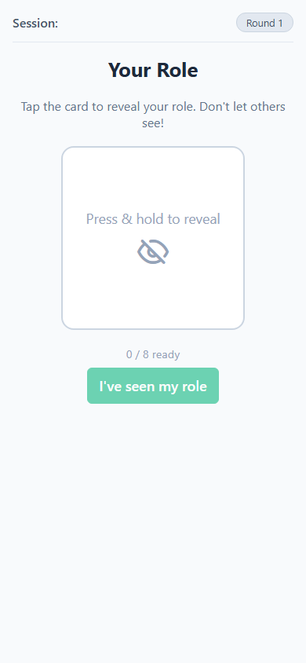
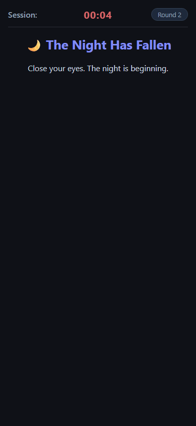
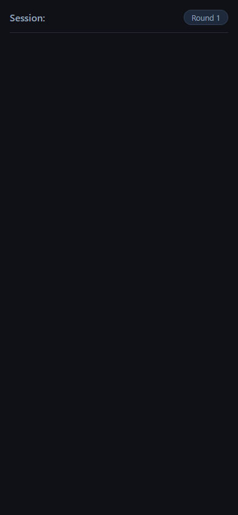
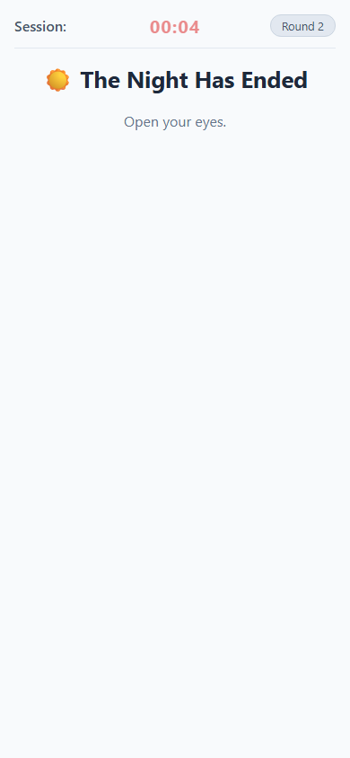
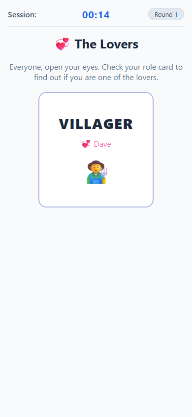
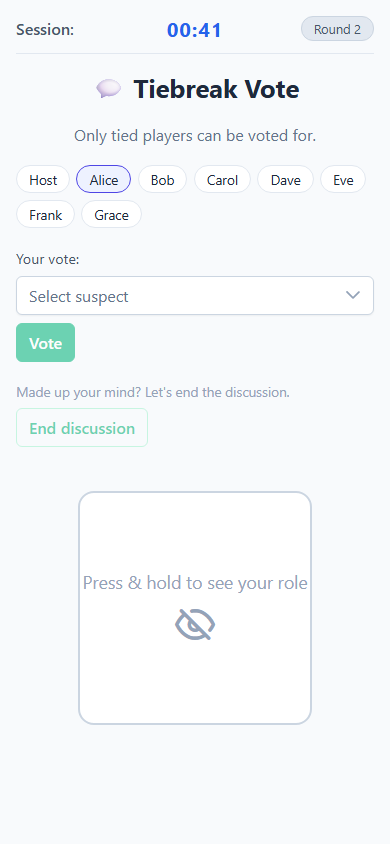
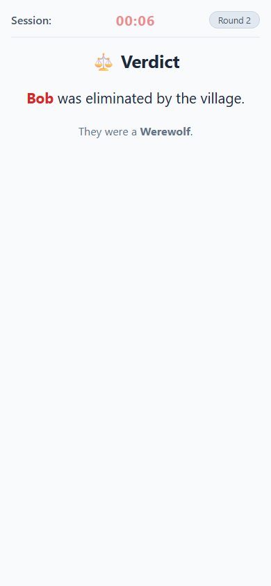
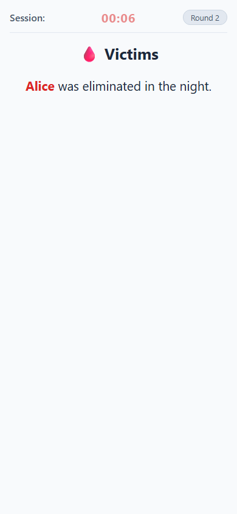
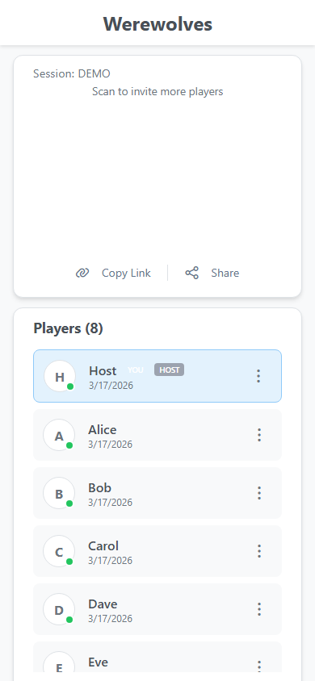

# Screens

### 1. Create & Join

The host creates a game and receives a QR code and shareable link. Other players scan the QR code or open the link on their own phones and enter their name.

  <figure style="flex:1;margin:0"><figcaption><strong>Create Game</strong></figcaption></figure>
  <figure style="flex:1;margin:0"><figcaption><strong>Join Game</strong></figcaption></figure>

---

### 2. Lobby

All players wait in the lobby while the host configures the game. Non-host players see the settings in read-only mode; only the host can change them and start the game.

The Start Game button is only visible to the host and is disabled until sufficient players have joined and all skill/werewolf counts are consistent with the player count.

---

### 3. Role Reveal

Once the game starts, each player privately views their assigned role by pressing and holding their role card. The card flips back the moment they release, so no-one nearby can glance at it.

Werewolves see the names of all fellow werewolves on their card. When everyone confirms they have seen their role, the first night begins.

---

### 4. Night Announcement

Once Role Reveal ends, the app transitions into night with a brief full-screen announcement. The screen dims to the night theme and a countdown runs while the narration plays, giving everyone a moment to settle before the first night action begins.

---

### 5. Werewolves Meeting *(Round 1 only)*

On the very first night, before anything else happens, the werewolves open their eyes and identify each other silently. The werewolf screen shows the names of all pack members and an "I'm ready" button. Once all wolves have confirmed, the phase advances.

  <figure style="flex:1;margin:0"><figcaption><strong>Werewolf view</strong></figcaption></figure>
  <figure style="flex:1;margin:0"><figcaption><strong>Others' view</strong></figcaption></figure>

#### Werewolves Close Eyes

The werewolves close their eyes before the next phase begins. The screen shows a blank night background — no content is displayed. The phase auto-advances after 6 seconds.

---

### 6. Cupid *(Round 1 only)*

Cupid wakes up and secretly links two players as lovers. Cupid selects two players from the alive-players list and confirms. The lovers are notified privately during the Lovers Reveal phase that immediately follows.

  <figure style="flex:1;margin:0"><figcaption><strong>Cupid view</strong></figcaption></figure>
  <figure style="flex:1;margin:0"><figcaption><strong>Others' view</strong></figcaption></figure>

#### Cupid Close Eyes

Cupid closes their eyes before the night continues. Blank night screen, auto-advances after 6 seconds.

---

### 7. Day Announcement

Once the night phase ends, the app transitions to day with a brief full-screen announcement. Everyone opens their eyes and the app switches to the day theme while the narration plays.

---

### 8. Lovers Reveal *(Round 1 only)*

Everyone opens their eyes and checks their role card to see if they are one of the lovers. If a player is a lover, their partner's name appears on the card when held down. All other players see their usual role with no lover name.

---

### 9. Discussion & Voting

Players discuss freely, sharing suspicions and defending themselves. Every player — including those already eliminated — casts one vote for who they believe is a werewolf. A countdown timer governs the discussion period.

Each player's current vote is shown live on their chip as an arrow (e.g. **Alice → Bob**), making alliances and suspicions immediately visible and fuelling the discussion.

When a player has made up their mind and wants to wrap up early, they can press **End discussion**. How many players have pressed this is shown next to the button (e.g. `3 / 8`), but only once at least one player has done so — the counter stays hidden otherwise so it does not invite premature use.

Eliminated players see a notice explaining they have been eliminated but can still vote to earn bonus points. When the timer ends or all living players confirm, votes are tallied.

  <figure style="flex:1;margin:0"><figcaption><strong>Alive player</strong></figcaption></figure>
  <figure style="flex:1;margin:0"><figcaption><strong>Eliminated player</strong></figcaption></figure>

---

### 10. Tiebreak Discussion *(if a tie occurs)*

If two or more players are tied for most votes, a second short discussion round takes place. Only the tied candidates can be voted for this time.

If the tiebreak vote is also tied, no elimination occurs and the game moves straight to night.

---

### 11. Day Elimination

The player with the most votes is eliminated and their role is publicly revealed to everyone. Win conditions are checked immediately after each elimination. If the Hunter was just eliminated, the Hunter phase activates before the game continues.

---

### 12. The Hunter *(triggered on elimination)*

The Hunter phase activates whenever the Hunter is eliminated — either by werewolves at night or by the village vote during the day. The Hunter gets one last action: shooting a player of their choice. The selected player is immediately eliminated and win conditions are re-checked.

  <figure style="flex:1;margin:0"><figcaption><strong>Hunter view</strong></figcaption></figure>
  <figure style="flex:1;margin:0"><figcaption><strong>Others' view</strong></figcaption></figure>

---

### 13. Werewolves *(Round 2 onwards)*

The app narrates "close your eyes". The werewolf screen shows a dropdown of all living non-wolf players. Once every wolf has voted the same target (or the timer expires), the kill is locked in.

  <figure style="flex:1;margin:0"><figcaption><strong>Werewolf view</strong></figcaption></figure>
  <figure style="flex:1;margin:0"><figcaption><strong>Others' view</strong></figcaption></figure>

---

### 14. The Seer *(Round 2 onwards)*

The Seer wakes up and inspects one player. The result reveals whether that player is a Werewolf or a Villager, and shows their skill if they have one. The Seer receives the result immediately on their screen — this information is theirs alone to use strategically during the day discussion.

  <figure style="flex:1;margin:0"><figcaption><strong>Seer view</strong></figcaption></figure>
  <figure style="flex:1;margin:0"><figcaption><strong>Others' view</strong></figcaption></figure>

#### Seer Close Eyes

The Seer closes their eyes before the night continues. Blank night screen, auto-advances after 6 seconds.

---

### 15. The Witch *(Round 2 onwards)*

The Witch wakes up last. She is shown tonight's werewolf victim and can use either, both, or none of her potions — each usable only once per game:

- 🧴 **Heal** — Saves tonight's werewolf victim; they survive the night
- ☠️ **Poison** — Eliminates any living player of the Witch's choice

  <figure style="flex:1;margin:0"><figcaption><strong>Witch view</strong></figcaption></figure>
  <figure style="flex:1;margin:0"><figcaption><strong>Others' view</strong></figcaption></figure>

#### Witch Close Eyes

The Witch closes their eyes before the night ends. Blank night screen, auto-advances after 6 seconds.

---

### 16. Victims *(Round 2 onwards)*

The app reveals what happened overnight. Everyone "opens their eyes" and sees the night's outcome.

Possible outcomes:

- One or more players were killed by werewolves (and possibly saved or poisoned by the witch)
- The village woke up safely — nobody was taken
- The Witch saved the victim, but also poisoned someone else

---

### 17. Final Scores Reveal

The game ends when a win condition is met. All roles are revealed in a summary table, sorted by score. From the second game onwards a running **total** column appears alongside each player's per-game score, so everyone can see the tournament standings at a glance.

Win conditions:

- **Village** — All werewolves have been eliminated
- **Werewolves** — Werewolves equal or outnumber the surviving villagers
- **Lovers** — Both lovers survive to the end (only applies when they are from opposing teams)

Players return to the lobby and can start a new game.

  <figure style="flex:1;margin:0"><figcaption><strong>After game 1</strong></figcaption></figure>
  <figure style="flex:1;margin:0"><figcaption><strong>After game 2+ (with totals)</strong></figcaption></figure>

---

### 18. Tournament Pass

Starting a second (or later) game requires a tournament pass. When the host presses **Start Game** from game 2 onwards, a modal appears asking for the pass code. Entering the correct code unlocks the tournament and starts the game immediately. An incorrect code shows an error and lets the host try again.

